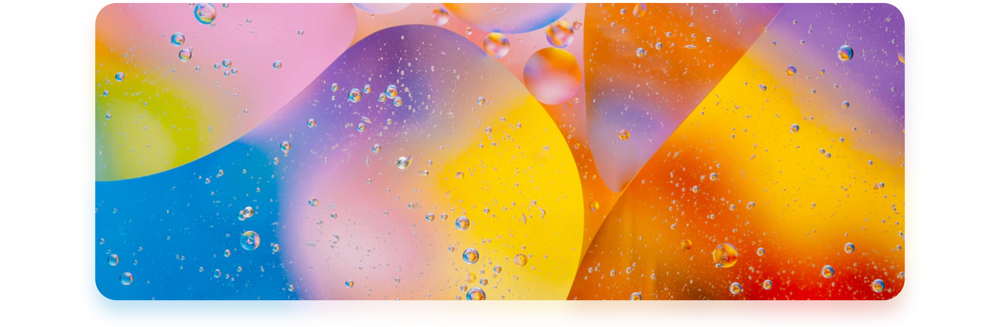
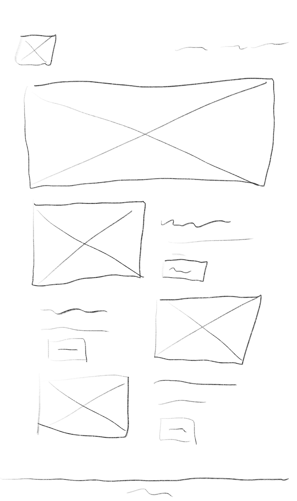

# Mediendesign - Responsive Landingpage

## Links

- [Github](https://github.com/adrian-goe/mediendeisgn-project) 
- [Dokumentation online](https://github.com/adrian-goe/mediendeisgn-project/blob/master/doku/DOCUMENTATION.md) 
- [Dokumentation PDF](https://github.com/adrian-goe/mediendeisgn-project/blob/master/doku/DOCUMENTATION.pdf) 
- [Webseite](https://yimeko.com/home)

## Person

- Adrian Görisch
- Matrikelnummer: 1476402
- Email: adrian.goerisch@stud.hs-hannover.de

## Kaffee

Im Rahmen des Faches Mediendesign haben wir die Aufgabe bekommen eine responsive Landingpage zu entwickeln. Ich habe mich dazu entscheiden, eine Seite über Kaffee zu entwicklen.
Ich habe Angular als Framework meiner Wahl gewählt, da Angular eine saubere Component Architektur ermöglicht. Dadurch können einzelne Elemente einfacher wiederverwendet werden.

## Design Elemente

Damit ich etwas neues lernen und ausprobieren kann, habe ich versucht, bei dem Heroimage einen Farbigen Schatten zu machen. Der ist durch CSS Proberties alleine nicht machbar.
Um diesen Effekt zu erhalten habe ich das Bild zweimal übereinander gelegt. Das untere Bild hat einen `filter: blur()` bekommen. Das bild wird unscharf und die Farben gehen über die Bildgröße hinaus. Dadurch Entsteht dann ein Schatten Effekt. 
Besonders deutlich sieht man das, wenn man das Bild gegen ein Farbenfrohes Bild austauscht.

[HTML Code](../src/app/shared/header-image/header-image.component.html)

[SCSS Code](../src/app/shared/header-image/header-image.component.scss)

## Seiten Performance

Für die eine Mobile Anwendung ist die Seiten performance ein besonders wichtiges Thema. Da in einer Angular Anwendung immer die komplette Seite geladen wird, ist der initiale Ladeaufwand sehr hoch. Damit das nicht so ist, habe ich mich mit [scully](schully.io) beschäftigt.
Scully generiert aus dynamischen Angularseiten statische HTML Datein. Erst am ende, nach dem initialen Rendern wird die Angular anwendung nachgeladen.

Besonders menge der übertragen Daten bis zum initialen Renden (Ohne Bilder) unterscheidet sich stark:

|Angular|Scully|
|---|---|
|179,19KB|20.81KB|

Der Unterschied mag hier nur sehr gering sein. Wird das Projekt aber größer und mit mehr untersieten, wird auch das Angular-Bundle größer. Erst wenn das vollständig übertragen ist, kann die Seite gerendert werden.

## Skizze

